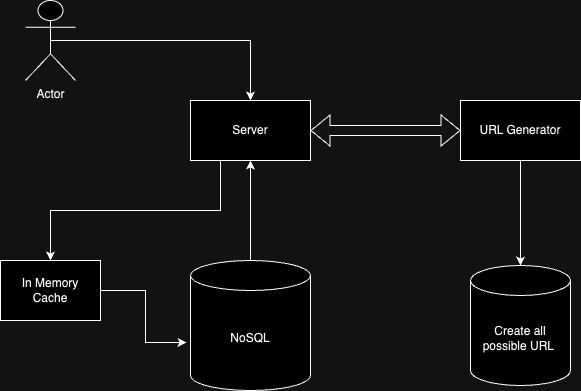

# URL Shortener (e.g., Bitly, TinyURL)

## Non-functional Requirements

- **Write to Read ratio:** 1:100
- **Usage:** Billions per month
- **Character Set:** 0-9, a-z, A-Z (Total: 62^8 ~ 218,340 million possible)
- **Storage:**
  - Input string: 100 Bytes
  - Output string: 8 Bytes
  - Total: 108 Bytes per user
  - Metadata: 1000 Bytes per user
  - Total: 1 Trillion Bytes per month

## High-Level Design

### Storage Solution

Utilize NoSQL for storing metadata, as ACID rules are not necessary due to the absence of complex queries and joins.

### Cache

Implement an in-memory cache for frequently accessed URLs, with a storage capacity of around 256GB. Employ the LRU (Least Recently Used) algorithm for cache management.

### Redirection Process

- HTTP Status Codes:
  - 300: Resource moved
  - 301: Permanent redirection
- Response Header:
  - Use the "location" field for the actual URL.
- Caching:
  - Browser caches the redirect URL for 301.
  - No caching for 302.

### URL Generation without Collision

1. Generate all possible URLs and store in the database.
2. Use a URL generator service to fetch and mark URLs as used or delete from the database.
3. Periodically load URLs from the database into the URL generator's memory for faster access.
4. Keep track of used URLs in key-value storage for re-use after expiration.
5. To handle simultaneous requests from different servers, employ ACID properties and a SQL database for storing unique URLs.

### URL Deletion and Expiry

Implement a cleanup service:

- Periodically reads from the NoSQL database.
- Checks for expiration dates.
- Marks keys as unused in the SQL database for re-use.
- Handles cleanup and ensures timely expiration.

This approach ensures efficient URL shortening, redirection, and management while meeting the specified non-functional requirements.

